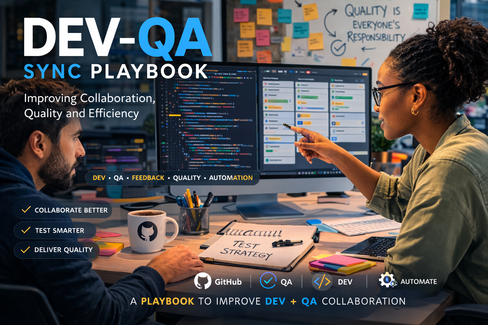

  

# Dev-QA Sync Playbook

Community project exploring **collaboration between Developers and QA Engineers**.

This repository investigates common friction points between development and quality assurance teams and proposes practical strategies to improve collaboration, feedback flow and testing efficiency.

---

## Objective

Help QA professionals support **multiple development teams** without becoming a bottleneck.

The project collects real feedback from developers and QA professionals and transforms it into a **practical collaboration playbook**.

---

## Key Topics

• Dev and QA collaboration  
• Bug reporting best practices  
• QA supporting multiple squads  
• Risk-based testing strategy  
• Agile workflow between Dev and QA  
• Quality ownership in engineering teams  

---

## Repository Structure

docs/ → research and playbook
templates/ → QA workflow templates
assets/ → diagrams and visuals

---

## Playbook

The collaboration playbook includes:

- Definition of Ready for QA
- Definition of Done with quality criteria
- Risk-based testing strategy
- QA handoff guidelines
- Bug reporting standards

---

## Why this project exists

In many companies a **single QA supports multiple development teams**.

Without structure this leads to:

- QA bottlenecks
- unclear bug reports
- late feedback
- inefficient testing cycles

This project proposes a **structured workflow to improve Dev–QA collaboration**.

---

## Contributing

Developers and QA engineers are welcome to share their experiences and suggestions.

---

## Author

Ivaneide Monteiro  
QA Analyst | Test Automation | Quality Engineering
